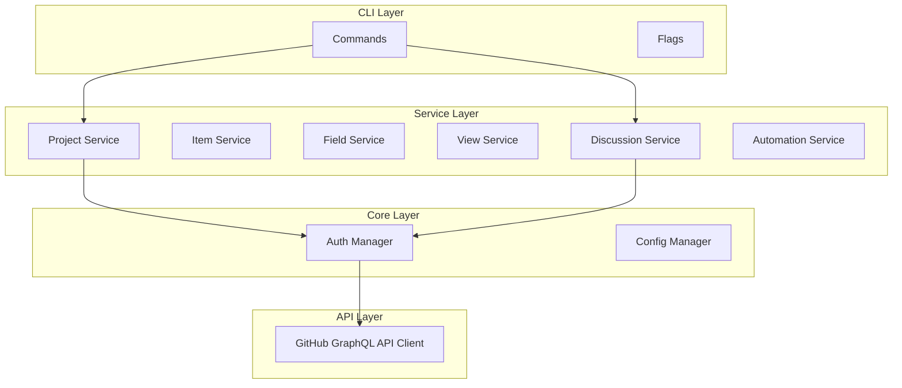

# ghx-cli

[](https://github.com/roboco-io/ghx-cli/actions)
[](https://github.com/roboco-io/ghx-cli/actions/workflows/ci.yml)
[](https://goreportcard.com/report/github.com/roboco-io/ghx-cli)
[](https://go.dev/)
[](https://opensource.org/licenses/MIT)

> 🚧 **Work in Progress** - This tool is under active development. See [Issues](https://github.com/roboco-io/ghx-cli/issues) for current status and roadmap.

**ghx-cli** (GitHub eXtensions) is a powerful command-line interface for GitHub features not fully supported by the official `gh` CLI. It provides complete control over GitHub Projects v2 and GitHub Discussions.

## Why ghx-cli?

The official GitHub CLI (`gh`) has limited support for several GitHub features:

### GitHub Projects v2 (81% of features missing from `gh`)
- ❌ **View Management** - No support for table, board, or roadmap views
- ❌ **Automation Workflows** - No automation or workflow management
- ❌ **Bulk Operations** - No batch processing capabilities
- ❌ **Advanced Filtering** - Limited search and filtering options
- ❌ **Reporting & Analytics** - No charts, statistics, or reports

### GitHub Discussions (No native support in `gh`)
- ❌ **Discussion CRUD** - No create, list, view, edit, delete commands
- ❌ **Comment Management** - No comment or reply support
- ❌ **Answer Marking** - No Q&A answer management
- ❌ **State Management** - No close, reopen, lock, unlock commands

**ghx-cli fills these gaps** with comprehensive support for both features.

## Features

### ✅ Current Features

#### Core Project Management
- **Projects**: Create, list, view, edit, and delete projects
- **Authentication**: GitHub CLI integration with token-based authentication
- **Cross-platform**: Support for macOS, Linux, and Windows

#### Item Management
- **Items**: Add, list, view, edit, and remove project items
- **Item Types**: Support for issues, pull requests, and draft items
- **Advanced Search**: Search across GitHub repositories with filtering

#### Field Management
- **Field Operations**: Create, list, update, and delete custom fields
- **Field Types**: Support for text, number, date, single/multi-select, and iteration fields
- **Field Options**: Manage select field options (add, update, delete)

#### View Management
- **View Operations**: Create, list, update, delete, and copy project views
- **View Layouts**: Support for table, board, and roadmap layouts
- **View Configuration**: Sort and group views by custom fields
- **View Filtering**: Apply filters to customize view content

#### Workflow Automation
- **Workflows**: Create, list, update, delete, enable, and disable workflows
- **Triggers**: Add triggers for automation (field changes, item events)
- **Actions**: Add actions for automation (set field, move item, notify, assign, etc.)
- **Action Types**: set-field, clear-field, move-to-column, archive-item, notify, assign, add-comment

#### Analytics & Reporting
- **Analytics**: Project overview and bulk operations
- **Export**: Export project data in various formats
- **Reporting**: Basic project statistics and insights

#### Discussion Management
- **Discussions**: List, view, create, edit, and delete discussions
- **Comments**: Add comments and replies to discussions
- **Answers**: Mark and unmark comments as answers (Q&A categories)
- **State Management**: Close, reopen, lock, and unlock discussions
- **Categories**: List and filter by discussion categories

### 🚧 In Development (See [Issues](https://github.com/roboco-io/ghx-cli/issues))

#### Phase 2: Enhanced Features - Q2 2024
- [ ] Interactive TUI mode with Bubble Tea
- [ ] Bulk import/export (CSV, JSON, Excel)
- [ ] Advanced filtering and search operators
- [ ] Iteration management and sprint planning

#### Phase 3: Advanced Analytics - Q3 2024
- [ ] Burndown and velocity charts
- [ ] Custom report templates
- [ ] Time tracking and reporting
- [ ] Progress visualization

#### Phase 4: Enterprise Features - Q4 2024
- [ ] Cross-repository projects
- [ ] 50,000+ item support
- [ ] Backup and restore
- [ ] Migration from Jira/Trello/Asana
- [ ] Team collaboration features

## Installation

### Homebrew (macOS/Linux)
```bash
brew install ghx-cli
```

### Go Install
```bash
go install github.com/roboco-io/ghx-cli/cmd/ghx@latest
```

### Download Binary
```bash
curl -L https://github.com/roboco-io/ghx-cli/releases/latest/download/ghx-$(uname -s)-$(uname -m) -o ghx
chmod +x ghx
mv ghx /usr/local/bin/
```

### Docker
```bash
docker run --rm ghcr.io/roboco-io/ghx-cli:latest --help
```

## Quick Start

```bash
# Authentication - uses existing gh CLI tokens
gh auth login  # First, authenticate with GitHub CLI
ghx auth status  # Check authentication status (coming soon)

# Or use environment variables as fallback
export GITHUB_TOKEN="your-github-token"

# List projects
ghx list --org myorg
ghx list --user myuser

# Create a project
ghx create "My Project" --org myorg --description "Project description"

# View project details
ghx view PROJECT_ID

# Add items to project
ghx item add PROJECT_ID --issue owner/repo#42
ghx item add PROJECT_ID --pr owner/repo#43
ghx item add PROJECT_ID --draft "Task title" --body "Task description"

# Manage fields
ghx field create PROJECT_ID "Priority" --type single_select --options "High,Medium,Low"
ghx field list PROJECT_ID

# --- GitHub Discussions ---

# List discussions
ghx discussion list owner/repo
ghx discussion list owner/repo --category ideas --state open

# View a discussion
ghx discussion view owner/repo 123

# Create a discussion
ghx discussion create owner/repo --category general --title "Question" --body "How do I...?"

# Manage discussion state
ghx discussion close owner/repo 123 --reason resolved
ghx discussion reopen owner/repo 123
ghx discussion lock owner/repo 123 --reason spam

# Add comments
ghx discussion comment owner/repo 123 --body "Thanks for the answer!"

# Mark answer (Q&A categories)
ghx discussion answer owner/repo 123 --comment-id DC_xxx

# List categories
ghx discussion category list owner/repo
```

## Configuration

Create a config file at `~/.ghx.yaml`:

```yaml
# GitHub authentication
token: "your-github-token"
org: "default-org"

# Output preferences
format: "table"  # table, json, yaml
no-cache: false
debug: false

# Default limits
limit: 50
```

Environment variables:
- `GHX_TOKEN` or `GITHUB_TOKEN` - GitHub Personal Access Token
- `GHX_ORG` - Default organization
- `GHX_FORMAT` - Default output format (table, json, yaml)
- `GHX_DEBUG` - Enable debug output

## Examples

See [docs/examples.md](docs/examples.md) for comprehensive usage examples.

## Architecture



## Development

### Prerequisites
- Go 1.21+
- Git
- Make

### Setup
```bash
git clone https://github.com/roboco-io/ghx-cli.git
cd ghx-cli
make setup
```

### Testing
```bash
make test           # Run all tests
make test-unit      # Unit tests only
make coverage       # Generate coverage report
make lint           # Run linter
```

### Building
```bash
make build          # Build binary
make install        # Install to GOPATH/bin
```

### Contributing

We welcome contributions! Please see:
- [Contributing Guide](CONTRIBUTING.md)
- [Development Setup](docs/DEVELOPMENT.md)
- [Architecture Overview](docs/ARCHITECTURE.md)
- [Open Issues](https://github.com/roboco-io/ghx-cli/issues)

## Roadmap

See our [detailed roadmap](docs/PRD.md#14-타임라인) and [feature comparison](docs/feature-comparison.md).

## Support

- 📖 [Documentation](docs/)
- 🐛 [Bug Reports](https://github.com/roboco-io/ghx-cli/issues/new?template=bug_report.md)
- 💡 [Feature Requests](https://github.com/roboco-io/ghx-cli/issues/new?template=feature_request.md)
- 💬 [Discussions](https://github.com/roboco-io/ghx-cli/discussions)

## License

[MIT License](LICENSE) - see the [LICENSE](LICENSE) file for details.

## Acknowledgments

- GitHub team for the Projects v2 and Discussions APIs
- [Charm](https://charm.sh/) for excellent TUI libraries
- [spf13/cobra](https://github.com/spf13/cobra) for CLI framework
- [shurcooL/graphql](https://github.com/shurcooL/graphql) for GraphQL client
- All contributors and early adopters

---

**Star ⭐ this repo if you find it useful!**