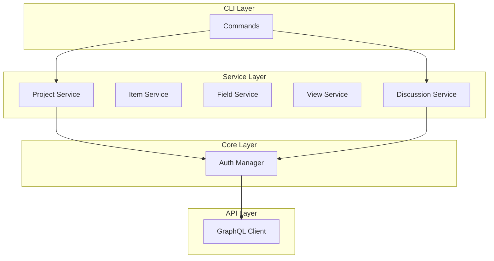

# ghx-cli

[](https://github.com/roboco-io/ghx-cli/actions/workflows/ci.yml)
[](https://goreportcard.com/report/github.com/roboco-io/ghx-cli)
[](https://go.dev/)
[](https://opensource.org/licenses/MIT)

**ghx-cli** (GitHub eXtensions) is a command-line interface for GitHub features not fully supported by the official `gh` CLI. It provides control over GitHub Projects v2 and GitHub Discussions through the GraphQL API.

## Why ghx-cli?

The official GitHub CLI (`gh`) has limited support for several GitHub features:

### GitHub Projects v2
- **View Management** - No support for creating/managing table, board, or roadmap views
- **Workflow Automation** - No workflow or automation management
- **Bulk Operations** - No batch processing capabilities
- **Field Management** - Limited custom field support

### GitHub Discussions
- **No native support** - `gh` doesn't provide discussion commands
- **CRUD Operations** - Create, list, view, edit, delete discussions
- **State Management** - Close, reopen, lock, unlock
- **Comments & Answers** - Add comments, mark answers for Q&A

## Features

### Project Management (`ghx project`)
- **Projects**: Create, list, view, edit, delete, export, import
- **Templates**: Save and apply project templates
- **Workflows**: Create automation rules with triggers and actions
- **Repository Linking**: Link projects to repositories

### Item Management (`ghx item`)
- **Items**: Add, list, view, edit, remove project items
- **Item Types**: Issues, pull requests, and draft items
- **Bulk Operations**: Add and update multiple items at once

### Field Management (`ghx field`)
- **Field Operations**: Create, list, update, delete custom fields
- **Field Types**: Text, number, date, single/multi-select, iteration
- **Field Options**: Add, update, delete select field options

### View Management (`ghx view`)
- **View Operations**: Create, list, update, delete, copy views
- **Layouts**: Table, board, and roadmap layouts
- **Configuration**: Sort, group, and filter views

### Discussion Management (`ghx discussion`)
- **Discussions**: List, view, create, edit, delete
- **State**: Close, reopen, lock, unlock discussions
- **Comments**: Add comments and replies
- **Answers**: Mark/unmark comments as answers (Q&A)
- **Categories**: List and filter by category

### Analytics (`ghx analytics`)
- **Overview**: Project statistics and insights
- **Export**: Export analytics data
- **Bulk Update**: Batch field updates

## Installation

### From Source
```bash
git clone https://github.com/roboco-io/ghx-cli.git
cd ghx-cli
make build
./bin/ghx --version
```

### Go Install
```bash
go install github.com/roboco-io/ghx-cli/cmd/ghx@latest
```

## Quick Start

```bash
# Authentication - uses existing gh CLI tokens
gh auth login
ghx auth status

# Or use environment variable
export GITHUB_TOKEN="your-github-token"

# --- Projects ---

# List projects
ghx project list --org myorg
ghx project list myuser

# Create a project
ghx project create "My Project" --org myorg

# View project details
ghx project view myuser/123

# Add items to project
ghx item add PROJECT_ID --issue owner/repo#42
ghx item add PROJECT_ID --pr owner/repo#43
ghx item add PROJECT_ID --draft "Task title" --body "Description"

# Manage fields
ghx field create PROJECT_ID "Priority" --type single_select --options "High,Medium,Low"
ghx field list PROJECT_ID

# Manage views
ghx view create PROJECT_ID "Sprint Board" --layout board
ghx view list PROJECT_ID

# --- Discussions ---

# List discussions
ghx discussion list owner/repo
ghx discussion list owner/repo --category ideas --state open

# View a discussion
ghx discussion view owner/repo 123

# Create a discussion
ghx discussion create owner/repo --category general --title "Question" --body "How do I...?"

# Manage state
ghx discussion close owner/repo 123 --reason resolved
ghx discussion reopen owner/repo 123
ghx discussion lock owner/repo 123

# Comments and answers
ghx discussion comment owner/repo 123 --body "Thanks!"
ghx discussion answer owner/repo 123 --comment-id DC_xxx

# List categories
ghx discussion category list owner/repo
```

## Configuration

Create a config file at `~/.ghx.yaml`:

```yaml
# GitHub authentication
token: "your-github-token"
org: "default-org"

# Output preferences
format: "table"  # table, json, yaml
no-cache: false
debug: false
```

Environment variables:
- `GITHUB_TOKEN` or `GH_TOKEN` - GitHub Personal Access Token (also uses `gh auth token`)
- `GHX_ORG` - Default organization
- `GHX_FORMAT` - Default output format
- `GHX_DEBUG` - Enable debug output

## Architecture



## Development

### Prerequisites
- Go 1.21+
- Git
- Make

### Setup
```bash
git clone https://github.com/roboco-io/ghx-cli.git
cd ghx-cli
make build
```

### Commands
```bash
make build          # Build binary to bin/ghx
make install        # Install to GOPATH/bin
make test           # Run all tests with coverage
make test-unit      # Run unit tests only (short mode)
make lint           # Run golangci-lint
make fmt            # Format code
```

### Pre-commit Hooks

This project uses [Lefthook](https://github.com/evilmartians/lefthook) for git hooks:

- **pre-commit**: Format, lint, and unit tests
- **pre-push**: Full test suite including E2E tests
- **commit-msg**: Validate commit message format

Commit message format: `type(scope): description`
- Types: `feat`, `fix`, `docs`, `style`, `refactor`, `test`, `chore`

### Testing
```bash
# Unit tests
make test-unit

# E2E tests (requires GitHub token with repo/project scopes)
make test-e2e

# All tests
make test
```

## Documentation

- [User Guide](docs/user-guide.md) - Comprehensive usage documentation
- [Examples](docs/examples.md) - Usage examples

## License

[MIT License](LICENSE)

## Acknowledgments

- [spf13/cobra](https://github.com/spf13/cobra) - CLI framework
- [shurcooL/graphql](https://github.com/shurcooL/graphql) - GraphQL client
